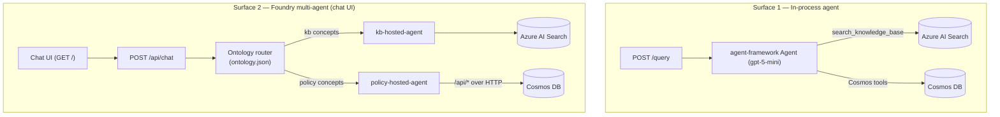
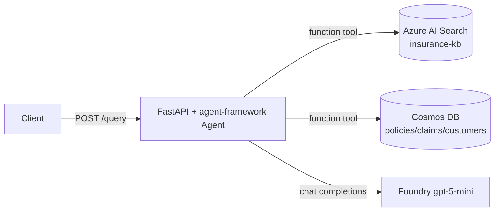
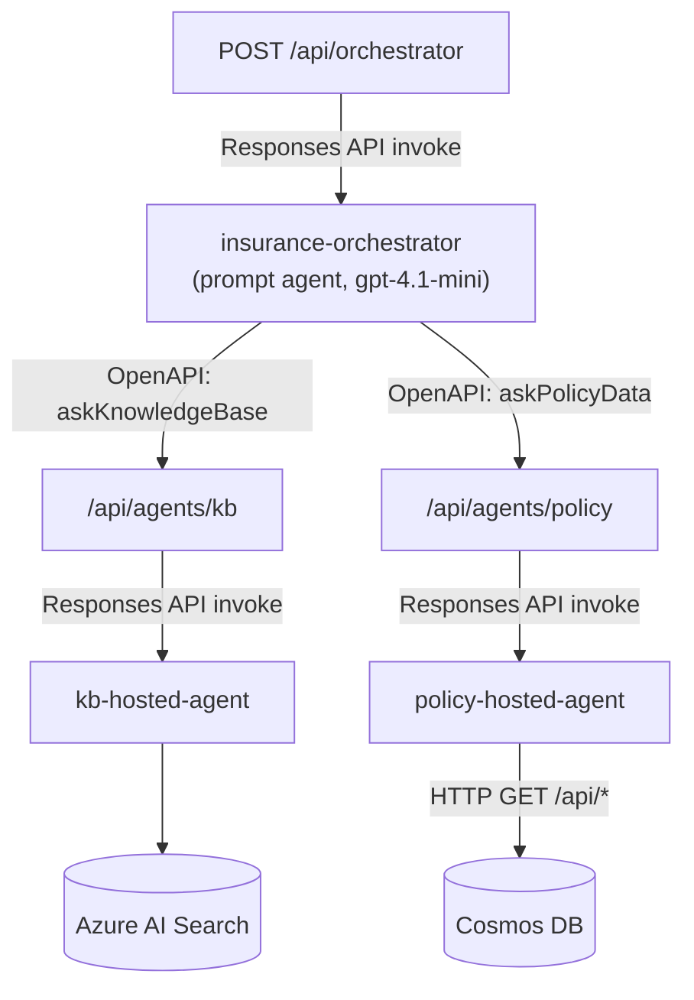
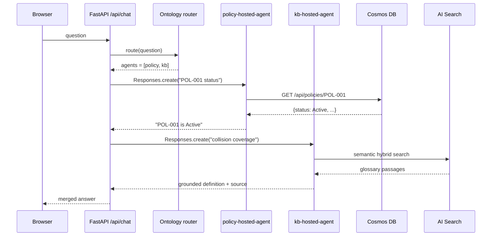
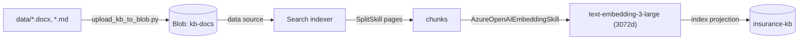

# Architecture — Insurance Agentic-RAG

Technical reference for the Insurance Agentic-RAG demo on Azure AI Foundry,
Azure AI Search, and Azure Cosmos DB.

- [1. Overview](#1-overview)
- [2. Component inventory](#2-component-inventory)
- [3. Two demo surfaces](#3-two-demo-surfaces)
- [4. Runtime topologies](#4-runtime-topologies)
- [5. Request flows](#5-request-flows)
- [6. Data plane](#6-data-plane)
- [7. Identity & RBAC](#7-identity--rbac)
- [8. Configuration reference](#8-configuration-reference)
- [9. Observability](#9-observability)
- [10. Design decisions & lessons](#10-design-decisions--lessons)
- [11. Security notes](#11-security-notes)

---

## 1. Overview

The demo answers auto-insurance questions with **agentic RAG** over two grounded
sources:

| Source | Service | Answers |
|--------|---------|---------|
| **Knowledge base** | Azure AI Search (hybrid vector + semantic) | Conceptual / educational questions — coverages, deductibles, claims process, terminology |
| **Policy & claims data** | Azure Cosmos DB for NoSQL | Specific policy, claim, and customer lookups |

An LLM decides which source(s) to consult per question and combines the
results. The repo ships **two independent ways** to deliver this, sharing the
same data plane:

1. **In-process agent** — a single FastAPI-hosted `agent-framework` agent that
   calls Search + Cosmos as function tools (`POST /query`).
2. **Foundry multi-agent system** — a browser chat UI (`POST /api/chat`) whose
   requests are routed by a **deterministic domain ontology** to two Foundry
   **hosted** leaf agents (knowledge base + policy). An optional LLM *delegating
   orchestrator* agent (`POST /api/orchestrator`) is kept for comparison.

---

## 2. Component inventory

| Component | Type | Where it runs | Purpose |
|-----------|------|---------------|---------|
| **FastAPI app** (`insurance_rag_agent`) | Python 3.13 / Uvicorn | App Service `<api-app>` (Linux B1) | Serves `/query`, `/api/*` Cosmos REST, `/api/agents/*` delegation, `/api/chat`, and the chat UI |
| **In-process agent** | `agent-framework` Agent (`gpt-5-mini`) | Inside the FastAPI app | Agentic RAG via Search + Cosmos function tools |
| **Ontology router** | In-process (`ontology.py` + governed `ontology.json`) | Inside the FastAPI app | Deterministically routes `/api/chat` to the KB and/or policy hosted agent(s) |
| **`kb-hosted-agent`** | Foundry **hosted** agent (containerized custom code, `gpt-4.1-mini`) | Foundry project | Queries Azure AI Search directly |
| **`policy-hosted-agent`** | Foundry **hosted** agent (`gpt-4.1-mini`) | Foundry project | Calls the app's `/api/*` Cosmos endpoints over HTTP |
| **`insurance-orchestrator`** | Foundry **prompt** agent (`gpt-4.1-mini`) | Foundry project | Optional (`/api/orchestrator`): delegates to the two hosted agents via an OpenAPI tool → `/api/agents/{kb,policy}` |
| **`kb-search-agent`** | Foundry prompt agent | Foundry project | Native Azure AI Search tool (portal demo) |
| **`policy-cosmos-agent`** | Foundry prompt agent | Foundry project | OpenAPI tool → `/api/*` (portal demo) |
| **`orchestrator-agent`** | Foundry prompt agent | Foundry project | Combined-tool router (Search + OpenAPI in one agent) |
| **Azure AI Search** `<search-service>` | PaaS | — | `insurance-kb` index, hybrid vector + semantic |
| **Azure Cosmos DB** `<cosmos-account>` | PaaS | — | `insurance` DB: policies / claims / customers. Private + keyless (policy-enforced) |
| **Azure Blob Storage** `<storage-account>` | PaaS | — | KB source docs (`kb-docs`) + governed `ontology` blob |
| **Azure OpenAI / Foundry** `<foundry-account>` | PaaS | — | Chat + embedding model deployments |
| **VNet + Cosmos private endpoint** | `Microsoft.Network/*` | — | Private path App Service → Cosmos (public access policy-disabled); private DNS zone `privatelink.documents.azure.com` |
| **Application Insights** | PaaS | — | gen_ai traces from the app and hosted agents |

Model deployments (all in the Foundry account):

| Model | Deployment | Used by |
|-------|-----------|---------|
| `gpt-5-mini` | GlobalStandard | In-process `/query` agent |
| `gpt-4.1-mini` | GlobalStandard, v2025-04-14 | All hosted + prompt agents (supports the Search/OpenAPI tools) |
| `text-embedding-3-large` | 3072 dims | Integrated vectorization in the Search indexer |

> **Why two chat models?** The `gpt-5` family supports only the code-interpreter
> and file-search tools in the Foundry Agent Service — it cannot drive the Azure
> AI Search or OpenAPI tools. Agents that use those tools therefore run on
> `gpt-4.1-mini`. The in-process agent does its own retrieval (no Agent-Service
> tool), so it can stay on `gpt-5-mini`.

---

## 3. Two demo surfaces



Both surfaces are served by the **same** FastAPI app and hit the **same** Search
index and Cosmos containers. `/api/chat` (the chat UI) routes deterministically
with the domain ontology; the optional LLM delegating orchestrator is exposed
separately at `/api/orchestrator`. The Foundry portal also exposes the prompt
agents (`kb-search-agent`, `policy-cosmos-agent`, `orchestrator-agent`) for a
no-code/portal demo.

---

## 4. Runtime topologies

### 4.1 In-process agent (`/query`)



The agent loop, tool selection, and answer synthesis all happen inside the app
process. Retrieval providers:
[search_provider.py](src/insurance_rag_agent/providers/search_provider.py),
[cosmos_provider.py](src/insurance_rag_agent/providers/cosmos_provider.py).

### 4.2 Ontology-routed chat (`/api/chat`) — the chat UI default

```mermaid
flowchart TD
    browser["Browser chat UI"] -->|POST /api/chat| chat["/api/chat"]
    chat -->|route(question)| onto["Ontology router<br/>(ontology.py + ontology.json)"]
    onto -->|policy concepts| polh["policy-hosted-agent"]
    onto -->|kb concepts| kbh["kb-hosted-agent"]
    kbh -->|query key / semantic hybrid| search[(Azure AI Search)]
    polh -->|HTTP GET /api/*| cosmosapi["/api/policies, /api/claims, ..."]
    cosmosapi --> cosmos[(Cosmos DB)]
```

`/api/chat` routes each question with a **deterministic domain ontology**
([ontology.py](src/insurance_rag_agent/ontology.py)) instead of an extra LLM hop:
concepts (Policy, Claim, Customer, CoverageSummary, Terminology, ...) each own a
specialist agent (`policy` → Cosmos hosted agent, `kb` → Search hosted agent).
The question is matched against each concept's id-patterns (regex) and labels,
the owning agent(s) are invoked via the Responses API, and their answers are
merged. Routing is explainable and fast (no nested model turn), and the response
includes the matched concepts and the agents it routed to.

The ontology metadata lives in **`ontology.json`** (governed) — it can be edited
without a code change. The app loads it from a governed blob (`ONTOLOGY_BLOB_URL`,
read keyless via managed identity) or a local path, with a packaged copy as an
always-available fallback, and hot-reloads on change (`ONTOLOGY_RELOAD_SECONDS`).

### 4.3 Delegating orchestrator (`/api/orchestrator`) — optional



This is **true agent-to-agent delegation**: the orchestrator never touches data
directly. It calls back into the app's `/api/agents/*` endpoints (its OpenAPI
tool), and each of those invokes a hosted leaf agent through the project's
OpenAI-compatible **Responses API** (agent-scoped base URL
`{project_endpoint}/agents/{name}/endpoint/protocols/openai`). It's slower
(nested model hop), so the chat UI uses the ontology router instead.

The delegation endpoints are **synchronous** FastAPI handlers so they run in the
threadpool — the blocking Responses call doesn't block the event loop, and the
re-entrant *app → orchestrator → app → leaf-agent* pattern works concurrently.

---

## 5. Request flows

### 5.1 Combined question (both sources) via `/api/chat`

`"Is policy POL-001 active, and explain collision coverage?"`



### 5.2 Routing rules (domain ontology)

| Question shape | Concept(s) | Agent |
|----------------|-----------|-------|
| Specific policy / claim / customer data, coverage totals | Policy, Claim, Customer, CoverageSummary | policy hosted agent |
| General / educational / terminology / coverage types / claims process | Terminology, CoverageType, ClaimsProcess | kb hosted agent |
| Both | — | both, then merge |

Routing is a pure function of the question text (regex id-patterns + label
substrings in `ontology.json`); when nothing matches, the ontology's
`default_agent` (kb) is used. The optional `/api/orchestrator` instead lets the
LLM orchestrator decide, and is instructed never to answer from its own
knowledge.

---

## 6. Data plane

### 6.1 Knowledge base (Azure AI Search)

Pull-based **integrated vectorization** pipeline
([setup_search_index.py](scripts/setup_search_index.py)):



- **Index `insurance-kb`** fields: `id` (key, keyword analyzer — required for
  index projections), `parent_id`, `title`, `content`, `source`,
  `contentVector` (Collection(Single), 3072 dims, HNSW profile + AzureOpenAI
  vectorizer). Semantic config: `insurance-kb-semantic`.
- **Skillset**: `SplitSkill` (pages, max 1800 chars, 200 overlap) →
  `AzureOpenAIEmbeddingSkill` → index projection (skip parent documents).
- **Query**: `VectorizableTextQuery` + `query_type=semantic` +
  `semantic_configuration_name` (hybrid). Falls back to plain hybrid if the
  semantic config is unavailable.

### 6.2 Policy data (Cosmos DB)

- Database `insurance`, containers `policies`, `claims`, `customers`.
- Loaded by [load_cosmos_data.py](scripts/load_cosmos_data.py) from
  [data/](data) (`policies.json`, `claims.json`, `customers.json`).
- Read-only access via the app's REST endpoints, which use
  [cosmos_provider.py](src/insurance_rag_agent/providers/cosmos_provider.py).

REST surface (also the policy agent's OpenAPI contract):

| Method & path | Operation |
|---------------|-----------|
| `GET /api/policies?status=&agency=` | List policies |
| `GET /api/policies/search?name=` | Find policies by customer name |
| `GET /api/policies/{policy_id}` | Get one policy |
| `GET /api/customers/search?name=` | Find customers by name |
| `GET /api/customers/{customer_id}` | Get one customer |
| `GET /api/claims?claim_id=&policy_id=&customer_id=` | Look up claims |
| `GET /api/coverage-summary` | Aggregate coverage stats |

Reference record: `POL-001` / `CUST-051` / Penelope Smith / policy number
`AU-72177252` / Active.

---

## 7. Identity & RBAC

All services use **Microsoft Entra ID** (`DefaultAzureCredential`) — no keys in
code (the one exception is the Search query key used by the hosted KB agent; see
[§10](#10-design-decisions--lessons)).

### 7.1 Managed identities

| Identity | Notes |
|----------|-------|
| Foundry **account** system-assigned MI | — |
| Foundry **project** system-assigned MI | Runtime identity of the hosted agents |
| App Service system-assigned MI | Invokes Foundry agents |

> Look up each principal/object ID at deploy time (e.g.
> `az webapp identity show`, `az cognitiveservices account show --query identity`)
> — don't hard-code tenant-specific object IDs.

### 7.2 Role assignments

| Identity | Role | Scope | Why |
|----------|------|-------|-----|
| App Service MI | Cosmos DB Built-in Data Contributor | Cosmos account | Read policy data |
| App Service MI | Search Index Data Reader | Search service | (In-process agent retrieval) |
| App Service MI | Cognitive Services OpenAI User | Foundry account | Chat/embeddings |
| App Service MI | **Foundry User** (`53ca6127-db72-4b80-b1b0-d745d6d5456d`) | Foundry account | **Invoke** Foundry agents via Responses API |
| Search MI | Cognitive Services OpenAI User | Foundry account | Integrated vectorization |
| Search MI | Storage Blob Data Reader | Storage account | Read KB docs |
| Dev user | Search / Cosmos / Storage / Foundry data roles | respective | Local data load + dev |

> In this tenant the role display name "Azure AI User" is absent; its GUID
> `53ca6127-...` resolves to **"Foundry User"**. Assign by GUID.

### 7.3 Network isolation

Cosmos DB has `publicNetworkAccess=Disabled` (Azure Policy-enforced), so the
App Service reaches it over a **private endpoint**: the app joins `snet-app`
(delegated to `Microsoft.Web/serverFarms`) via regional VNet integration, the
private endpoint lives in `snet-pe`, and the `privatelink.documents.azure.com`
private DNS zone (linked to the VNet) resolves the account host to the
endpoint's private IP. `WEBSITE_VNET_ROUTE_ALL=1` forces all app outbound
through the VNet. Search and Storage remain publicly reachable (keyless via
managed identity).

---

## 8. Configuration reference

App settings come from environment variables
([config.py](src/insurance_rag_agent/config.py), loaded via `.env` locally or
App Service application settings in Azure).

| Variable | Default | Used by |
|----------|---------|---------|
| `FOUNDRY_PROJECT_ENDPOINT` | — | Agent invocation, in-process agent |
| `FOUNDRY_CHAT_MODEL` | `gpt-5-mini` | In-process agent |
| `AZURE_SEARCH_ENDPOINT` | — | Search retrieval |
| `AZURE_SEARCH_INDEX` | `insurance-kb` | Search retrieval |
| `AZURE_SEARCH_SEMANTIC_CONFIG` | `insurance-kb-semantic` | Semantic ranking |
| `AZURE_SEARCH_VECTOR_FIELD` | `contentVector` | Vector query |
| `AZURE_SEARCH_API_KEY` | — | Hosted KB agent (query key) |
| `AZURE_STORAGE_BLOB_ENDPOINT` / `AZURE_STORAGE_RESOURCE_ID` / `AZURE_STORAGE_KB_CONTAINER` | — / — / `kb-docs` | KB indexer |
| `AZURE_OPENAI_ENDPOINT` / `AZURE_OPENAI_EMBEDDING_DEPLOYMENT` / `AZURE_OPENAI_EMBEDDING_DIMENSIONS` | — / `text-embedding-3-large` / `3072` | Embeddings |
| `COSMOS_ENDPOINT` | — | Cosmos retrieval |
| `COSMOS_DATABASE` | `insurance` | Cosmos retrieval |
| `COSMOS_{POLICIES,CLAIMS,CUSTOMERS}_CONTAINER` | `policies` / `claims` / `customers` | Cosmos retrieval |
| `POLICY_API_BASE_URL` | — | Policy agent OpenAPI server URL (must be public HTTPS) |
| `HOSTED_KB_AGENT_NAME` | `kb-hosted-agent` | `/api/agents/kb` |
| `HOSTED_POLICY_AGENT_NAME` | `policy-hosted-agent` | `/api/agents/policy` |
| `INSURANCE_ORCHESTRATOR_AGENT_NAME` | `insurance-orchestrator` | `/api/orchestrator` |
| `ONTOLOGY_BLOB_URL` | — | Governed ontology source (keyless blob) |
| `ONTOLOGY_PATH` | packaged `ontology.json` | Local/governed ontology file fallback |
| `ONTOLOGY_RELOAD_SECONDS` | `30` | Ontology hot-reload poll interval (0 disables) |
| `WEBSITE_VNET_ROUTE_ALL` / `WEBSITE_DNS_SERVER` | `1` / `168.63.129.16` | Route app outbound through the VNet; resolve the Cosmos private endpoint |
| `APPLICATIONINSIGHTS_CONNECTION_STRING` | — | Tracing |

Hosted-agent env vars are declared in each agent's
`agent.yaml` (`environment_variables:`); azd-managed values live in
`hosted-agents/<x>/.azure/<env>/.env` (gitignored).

---

## 9. Observability

- The app calls `configure_azure_monitor()` and instruments OpenAI via
  `opentelemetry-instrumentation-openai-v2` when
  `APPLICATIONINSIGHTS_CONNECTION_STRING` is set, emitting **gen_ai** spans for
  every model call and tool invocation.
- Hosted agents are wired to the same Application Insights component as the app,
  so orchestrator → leaf-agent traces are correlated end-to-end.

---

## 10. Design decisions & lessons

- **Hosted KB agent uses the Search query key, not keyless.** The hosted
  container caches its credential at startup; granting the project MI the
  Search role did not clear a persistent `403 Forbidden` (a redeploy with
  identical code does not restart the container). Using the read-only query key
  is deterministic. The key is **not** committed — it lives in a Foundry project
  connection (`CustomKeys`) and `agent.yaml` references it via the placeholder
  `${{connections.kb-search-key.credentials.AZURE_SEARCH_API_KEY}}`, which the
  platform resolves into the `AZURE_SEARCH_API_KEY` env var at container start.
  See [§11](#11-security-notes).
- **`gpt-5` cannot drive Agent-Service tools** → all tool-using agents run on
  `gpt-4.1-mini`.
- **`azd ai agent invoke` is unreliable for verification** in this tenant
  (`AzureDeveloperCLICredential` refresh-token expiry on the `ai.azure.com`
  scope). Verify through the backend (`/api/chat`, `/api/agents/*`) instead —
  the App Service MI handles that auth path.
- **Pull-based blob indexer** replaced an earlier push/chunk-in-Python approach
  so Search owns chunking + vectorization (integrated vectorization).
- **Cosmos is private + keyless (Azure Policy)**: two `modify`-effect policies
  (`CosmosDB_PublicNetwork_Modify`, `CosmosDB_LocalAuth_Modify`) force
  `publicNetworkAccess=Disabled` and `disableLocalAuth=true` on Cosmos accounts
  and silently revert any attempt to re-enable public access. The App Service
  therefore reaches Cosmos over a **private endpoint** via regional VNet
  integration (`WEBSITE_VNET_ROUTE_ALL=1` + Azure DNS + the
  `privatelink.documents.azure.com` zone), not a public IP allowlist. An earlier
  `0.0.0.0` "accept from Azure datacenters" firewall rule no longer works once
  the policy is in place.
- **Deterministic ontology router for `/api/chat`**: routing the chat UI through
  a governed domain ontology (`ontology.json`) instead of an LLM orchestrator is
  explainable, governable, and avoids a nested model hop. The LLM *delegating*
  orchestrator (`insurance-orchestrator`, `/api/orchestrator`) and the
  *combined-tool* router (`orchestrator-agent`) are kept for comparison.

---

## 11. Security notes

This is a **demo with synthetic data**. Before reusing any of it with real data:

- **No secrets are committed.** The hosted KB agent's Search query key is stored
  in a Foundry project connection (`kb-search-key`, `CustomKeys`) and referenced
  from `agent.yaml` via a `${{connections...}}` placeholder. The management API
  only ever returns the literal placeholder; the resolved secret never appears in
  source or in a GET response. Recreate the connection in your own project before
  deploying (see [SETUP.md](SETUP.md)).
- **`/api/*` Cosmos endpoints are unauthenticated.** They serve synthetic data
  only. Put them behind Entra ID / an API key / a private network before
  exposing real records.
- `.env`, `.env.*`, and `.azure/` (which hold endpoints, connection strings, and
  azd outputs) are gitignored — keep them out of source control.
- All other access is keyless via managed identity + Entra ID RBAC.
