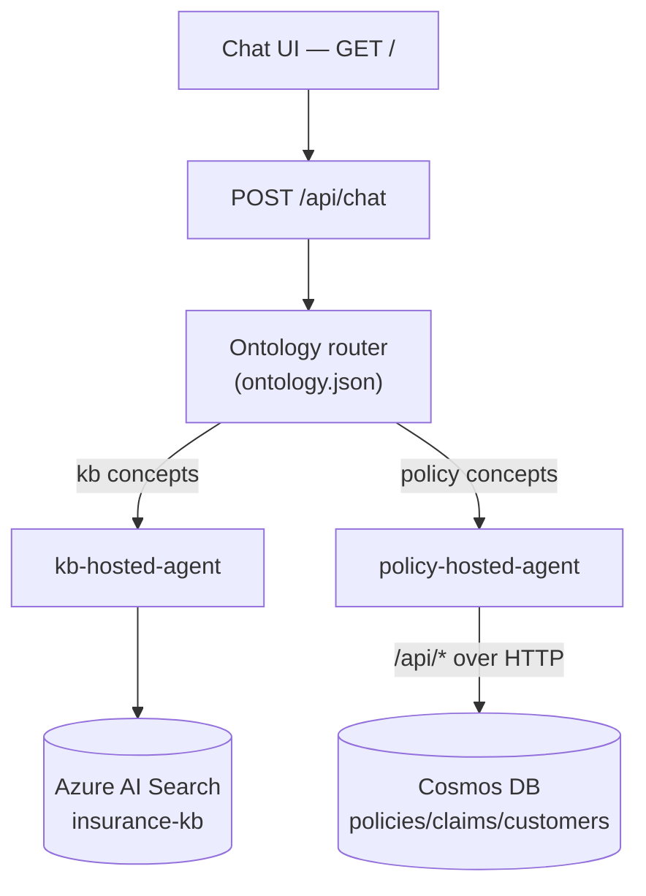

# Insurance Agentic-RAG — Azure AI Search + Cosmos DB + Foundry

<!-- Replace <owner>/<repo> with your GitHub repository once pushed. -->
[](../../actions/workflows/ci.yml)
[](../../actions/workflows/infra.yml)
[](../../actions/workflows/deploy-app.yml)
[](../../actions/workflows/deploy-hosted-agents.yml)

A customer demo that answers auto-insurance questions using **agentic RAG** over
two grounded data sources on Azure AI Foundry:

| Source | Service | Used for |
|--------|---------|----------|
| **Knowledge base** | **Azure AI Search** (hybrid vector + semantic) | Conceptual / educational questions — coverages, deductibles, claims process, terminology |
| **Policy & claims data** | **Azure Cosmos DB for NoSQL** | Specific policy, claim, and customer lookups |

A model decides which source(s) to consult per question and combines the
results.

> 📐 **Technical design:** [ARCHITECTURE.md](ARCHITECTURE.md) ·
> 🛠️ **Step-by-step setup:** [SETUP.md](SETUP.md)

## Two demo surfaces

The repo ships two ways to deliver the same experience over the same data plane:

1. **In-process agent** — a single FastAPI-hosted `agent-framework` agent
   (`gpt-5-mini`) that calls Search + Cosmos as function tools (`POST /query`).
2. **Foundry multi-agent system** — a browser chat UI (`GET /` → `POST /api/chat`)
   that routes each question through a **deterministic domain ontology** to two
   **hosted** leaf agents (knowledge base + policy). An optional LLM delegating
   orchestrator (`gpt-4.1-mini`) is available at `POST /api/orchestrator`.



The Foundry portal also exposes prompt agents (`kb-search-agent`,
`policy-cosmos-agent`, `orchestrator-agent`) for a no-code demo.

## Project layout

| Path | Purpose |
|------|---------|
| [src/insurance_rag_agent/main.py](src/insurance_rag_agent/main.py) | FastAPI app: `/query`, `/api/*` Cosmos REST, `/api/agents/*` delegation, `/api/chat`, chat UI |
| [src/insurance_rag_agent/agent_tools.py](src/insurance_rag_agent/agent_tools.py) | Function tools the in-process agent calls (Search + Cosmos) |
| [src/insurance_rag_agent/providers/search_provider.py](src/insurance_rag_agent/providers/search_provider.py) | Azure AI Search hybrid + semantic retrieval |
| [src/insurance_rag_agent/providers/cosmos_provider.py](src/insurance_rag_agent/providers/cosmos_provider.py) | Cosmos DB policy/claims/customer retrieval |
| [src/insurance_rag_agent/static/index.html](src/insurance_rag_agent/static/index.html) | Browser chat UI |
| [hosted-agents/kb/](hosted-agents/kb) | `kb-hosted-agent` — hosted Foundry agent over Azure AI Search |
| [hosted-agents/policy/](hosted-agents/policy) | `policy-hosted-agent` — hosted Foundry agent over the Cosmos REST API |
| [scripts/load_cosmos_data.py](scripts/load_cosmos_data.py) | Load `data/*.json` into Cosmos DB |
| [scripts/upload_kb_to_blob.py](scripts/upload_kb_to_blob.py) | Upload KB source docs to Azure Blob Storage |
| [scripts/setup_search_index.py](scripts/setup_search_index.py) | Build the AI Search index + blob indexer/skillset (integrated vectorization) |
| [scripts/setup_kb_agent.py](scripts/setup_kb_agent.py) · [setup_policy_agent.py](scripts/setup_policy_agent.py) · [setup_orchestrator_agent.py](scripts/setup_orchestrator_agent.py) · [setup_insurance_orchestrator_agent.py](scripts/setup_insurance_orchestrator_agent.py) | Register the Foundry prompt agents |
| [scripts/smoke_test.py](scripts/smoke_test.py) | Local check of both RAG sources |
| [scripts/deploy/](scripts/deploy) | `deploy-infra.ps1`, `deploy-app.ps1`, `grant-dev-access.ps1`, `create-search-connection.ps1` |
| [infra/main.bicep](infra/main.bicep) | Search + Cosmos + Storage + App Service + VNet/private endpoint + RBAC |
| [openapi/copilot-studio-insurance.openapi.yaml](openapi/copilot-studio-insurance.openapi.yaml) | Copilot Studio custom-connector contract |

## Data

In [data/](data) — all **synthetic**:

- `auto_insurance_knowledge_base.docx`, `auto_insurance_glossary.md` → Azure Blob Storage → Azure AI Search indexer (chunk + vectorize)
- `policies.json`, `claims.json`, `customers.json` → Cosmos DB

Reference record: `POL-001` / `CUST-051` / Penelope Smith / policy number
`AU-72177252` / Active.

## Prerequisites

- Python 3.13, Azure CLI (`az`), Azure Developer CLI (`azd` ≥ 1.25), an Azure subscription
- A Foundry project with `gpt-5-mini`, `gpt-4.1-mini`, and `text-embedding-3-large` deployed
  (project endpoint of the form `https://<foundry-account>.services.ai.azure.com/api/projects/<project>`)

## Quick start

```powershell
# 1. Environment
python -m venv .venv; .\.venv\Scripts\Activate.ps1
pip install -r requirements.txt
Copy-Item .env.example .env      # fill in endpoints after step 2
$env:PYTHONPATH = "src"

# 2. Provision Azure (Search + Cosmos + Storage + App Service + RBAC)
az login
.\scripts\deploy\deploy-infra.ps1 -ResourceGroup rg-ai-search-demo -Location eastus

# 3. Fill .env with the outputs (endpoints), then grant your user data access
.\scripts\deploy\grant-dev-access.ps1 -ResourceGroup rg-ai-search-demo `
    -SearchServiceName <name> -CosmosAccountName <name> -StorageAccountName <name>

# 4. Load data
python scripts\load_cosmos_data.py
python scripts\upload_kb_to_blob.py
python scripts\setup_search_index.py
python scripts\smoke_test.py

# 5. Run the API locally
uvicorn insurance_rag_agent.main:app --app-dir src --reload --port 8000
```

Full instructions — including deploying the FastAPI app to App Service,
registering the Foundry prompt agents, and deploying the two hosted agents — are
in **[SETUP.md](SETUP.md)**.

> **Note:** in subscriptions that enforce private Cosmos DB (public access
> disabled by Azure Policy), the data-load scripts (step 4) and local `/query`
> cannot reach Cosmos from a dev machine — run them from inside the VNet or a
> network with a private endpoint to Cosmos. See
> [infra/README.md](infra/README.md#governance-note--cosmos-is-private--keyless-enforced-by-policy).

## Try it

In-process agent:

```powershell
$body = @{ question = "What is my deductible on POL-001, and what does a deductible mean?" } | ConvertTo-Json
Invoke-RestMethod -Uri http://localhost:8000/query -Method Post -Body $body -ContentType application/json
```

Multi-agent chat UI: browse to `https://<apiAppName>.azurewebsites.net/`.

| Question | Routes to |
|----------|-----------|
| "What does comprehensive coverage cover?" | Knowledge base |
| "Show me policy POL-001" | Policy data |
| "List the claims for customer CUST-051" | Policy data |
| "Is POL-001 active and what is collision coverage?" | Both |
| "Give me a coverage summary" | Policy data |

## Authentication

Services use **Microsoft Entra ID** (`DefaultAzureCredential`) by default — no
keys in code. The App Service managed identity holds Search, Cosmos, OpenAI, and
**Foundry User** (agent-invoke) roles; the Search managed identity holds OpenAI
and Blob roles for integrated vectorization. See
[ARCHITECTURE.md §7](ARCHITECTURE.md#7-identity--rbac) and
[infra/README.md](infra/README.md).

> ⚠️ The hosted KB agent's Search query key is **not** committed — it lives in a
> Foundry project connection (`kb-search-key`) and `agent.yaml` references it via a
> `${{connections...}}` placeholder. The `/api/*` Cosmos endpoints are
> unauthenticated (synthetic data only). Review
> [ARCHITECTURE.md §11](ARCHITECTURE.md#11-security-notes) before reusing with
> real data or publishing the repo.

## Optional: Copilot Studio connector

Expose the API as a Copilot Studio action using
[openapi/copilot-studio-insurance.openapi.yaml](openapi/copilot-studio-insurance.openapi.yaml).
Full walkthrough: [docs/copilot-studio-action-setup.md](docs/copilot-studio-action-setup.md).
